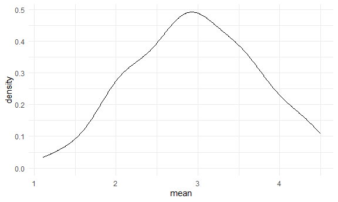
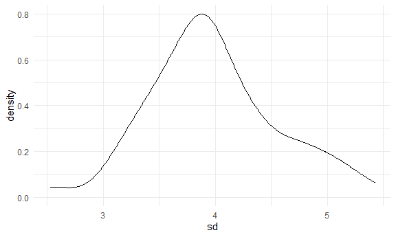

Simulation
================

``` r
library(tidyverse)
```

    ## -- Attaching packages --------------------------------------- tidyverse 1.3.0 --

    ## √ ggplot2 3.3.2     √ purrr   0.3.4
    ## √ tibble  3.0.4     √ dplyr   1.0.2
    ## √ tidyr   1.1.2     √ stringr 1.4.0
    ## √ readr   1.4.0     √ forcats 0.5.0

    ## -- Conflicts ------------------------------------------ tidyverse_conflicts() --
    ## x dplyr::filter() masks stats::filter()
    ## x dplyr::lag()    masks stats::lag()

``` r
library(rvest)
```

    ## Loading required package: xml2

    ## 
    ## Attaching package: 'rvest'

    ## The following object is masked from 'package:purrr':
    ## 
    ##     pluck

    ## The following object is masked from 'package:readr':
    ## 
    ##     guess_encoding

``` r
knitr::opts_chunk$set(
  fig.width = 6,
  fig.asp = .6,
  out.width = "90%"
)

theme_set(theme_minimal() + theme(legend.position = "bottom"))

options(
  ggplot2.continuous.colour = "viridis",
  ggplot2.continuous.fill = "viridis"
)


scale_colour_discrete = scale_color_viridis_d
scale_fill_discrete = scale_fill_viridis_d
```

## Let’s simulate something

I have a function

``` r
sim_mean_sd = function(sample_size, mu = 3, sigma = 4) {
  
  sim_data = 
  tibble(
    x = rnorm(n = sample_size, mean = mu, sd = sigma)
  )

sim_data %>% 
  summarize(
    mean = mean(x),
    sd = sd(x)
  )
  
}
```

I can “simulate” by running this line.

``` r
sim_mean_sd(sample_size = 30)
```

    ## # A tibble: 1 x 2
    ##    mean    sd
    ##   <dbl> <dbl>
    ## 1  3.50  3.66

## Let’s simulate a lot

Let’s start with a for loop.

``` r
output = vector("list", length = 100)

for (i in 1:100) {
  
  output[[i]] = sim_mean_sd(sample_size = 30)
  
}

bind_rows(output)
```

    ## # A tibble: 100 x 2
    ##     mean    sd
    ##    <dbl> <dbl>
    ##  1  3.78  3.91
    ##  2  2.43  3.46
    ##  3  3.38  4.16
    ##  4  2.05  3.01
    ##  5  1.64  3.95
    ##  6  1.67  4.60
    ##  7  3.21  3.96
    ##  8  1.91  4.06
    ##  9  2.66  3.94
    ## 10  3.12  3.48
    ## # ... with 90 more rows

Let’s use a loop function

``` r
sim_results = 
  rerun(100, sim_mean_sd(sample_size = 30)) %>% 
  bind_rows()
```

Let’s look at results

``` r
sim_results %>% 
  ggplot(aes(x = mean)) +
  geom_density()
```



``` r
sim_results %>% 
  summarize(
    avg_samp_mean = mean(mean),
    sd_samp_mean = sd(mean)
  )
```

    ## # A tibble: 1 x 2
    ##   avg_samp_mean sd_samp_mean
    ##           <dbl>        <dbl>
    ## 1          2.97        0.755

``` r
sim_results %>% 
  ggplot(aes(x = sd)) +
  geom_density()
```


